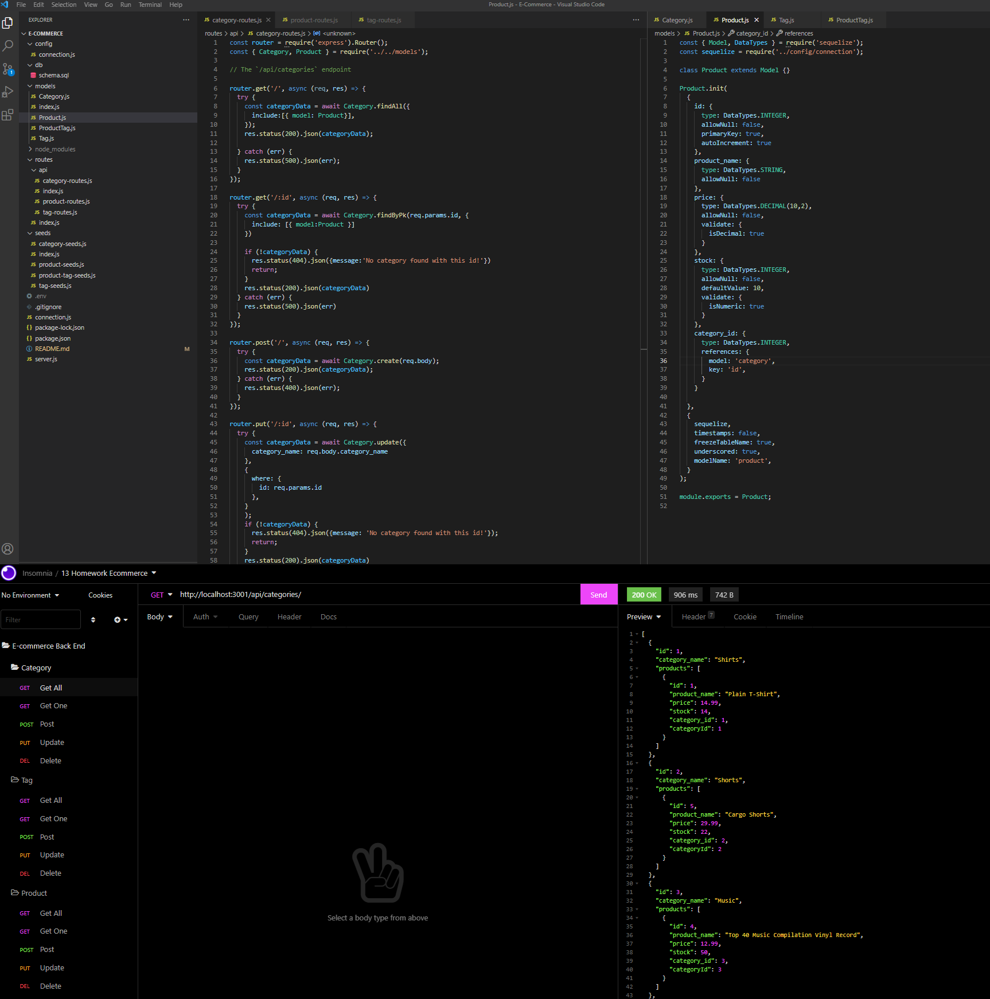

# E-commerce Back End 

  ## Description
  
  
This e-commerce back end is the result of modifying an already started database application to configure a working Express.js API that uses Sequelize. Throught the use of sequelize Models, the database can be viewed and changed using API routes. It is tested using Insomnia Core. 

  
  ## Table of Contents
  
  - [Installation](#installation)
  - [Usage](#usage)
  - [License](#license)
  - [Contributing](#license)
  - [Tests](#license)
  - [Questions](#license)
  
  ## Installation
  
  
- Add the database name, MySQL username and password to an enviornmental variable file.
- Install dependencies. 
- Start the database in MySQL 
- Seed the database in the terminal from the root folder using "node ./seeds/index" 
- Run npm start

  
  ## Usage
  
  
- Open Insomnia Core and use the corresponding routes to access and modify the API.

  
  

  
  ## License
  
  
Copyright (c) 2022, Cesar Sanchez All rights reserved.
Licensed under the MIT license. 

  
  
[License](./MIT_license.txt)

  
  ## How to Contribute
  
  
Develop the Front End

  
  ## Tests
  
  
Open the [video](https://drive.google.com/file/d/1eaoJXYo_R--n0j4XOLNgD5pufZ--C-y1/view?usp=sharing) to see the API working or follow the instructions for installation and usage to test it yourself.

  
  ## Questions
  
  If you have any question feel free to check my Github 
  
Username:csancheze
  
[Github](https://github.com/csancheze)

  or send me and email
  
<cesanchezesc@gmail.com>

